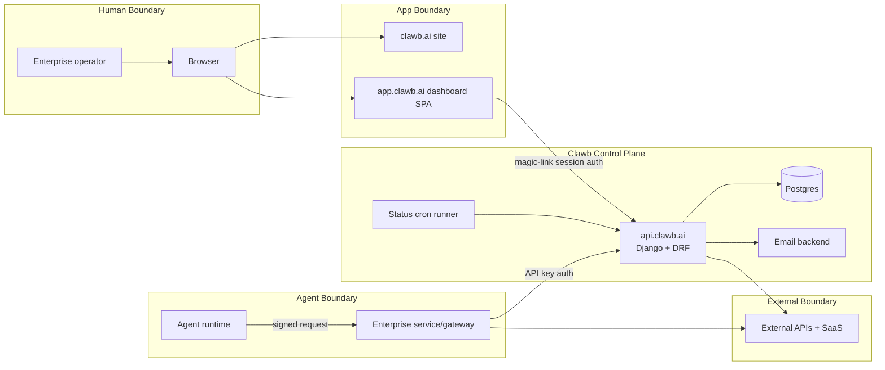
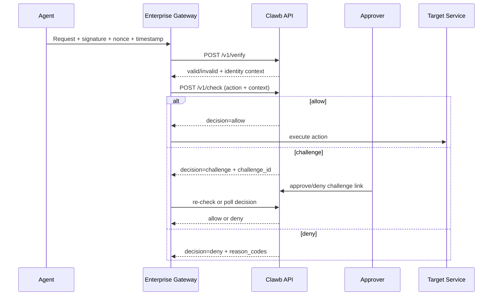
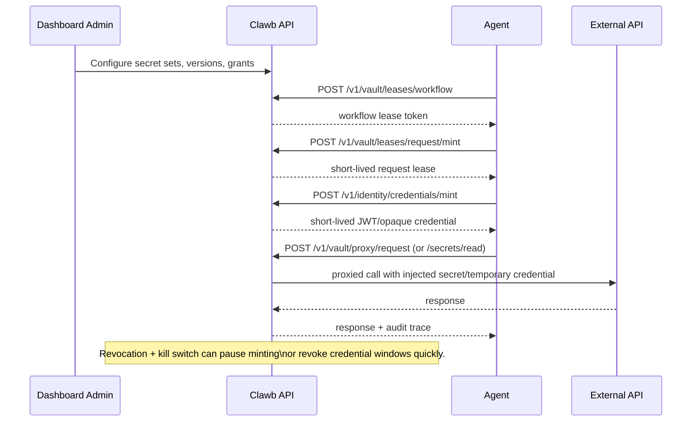
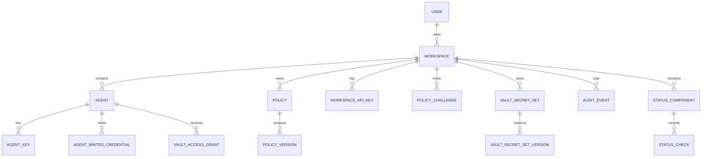

This document maps the current Clawb system architecture from the codebase.

## How to view visually
- GitHub: open this file in the repository UI (Mermaid renders automatically).
- VS Code: open this file and use Markdown Preview (`Cmd/Ctrl + Shift + V`).
- Mermaid Live Editor: copy/paste any diagram block into https://mermaid.live.

## 1) System Context

### Auth and trust boundaries

| Caller | Main auth mode | Primary endpoints |
|---|---|---|
| Dashboard user (browser) | Session cookie (magic link login) | `/auth/*`, `/v1/workspaces`, `/v1/agents`, `/v1/policies`, `/v1/vault/*` |
| Enterprise backend/gateway | Workspace API key | `/v1/check`, `/v1/workspace/*`, `/v1/identity/*` |
| Agent runtime | Signature + nonce/timestamp via relying service or signed agent endpoints | `/v1/verify`, `/v1/telemetry/heartbeat`, vault signed endpoints |
| Public approval links | Opaque one-time tokens | `/v1/approval-links/*`, `/v1/agent-approval/*`, `/v1/policy-challenges/*` |

## 2) End-to-End Decision Loop (Verify + Policy)

## 3) Vault + JWT Credential Path

## 4) Control Plane Domains

```mermaid
flowchart TD
  subgraph Auth & Workspace
    L1[POST /auth/start-login] --> L2[Email magic link]
    L2 --> L3[GET/POST /auth/verify-login]
    L3 --> L4[Session cookie + active workspace in session]
    L4 --> L5[GET /auth/me]
    L5 --> L6[GET/POST /v1/workspaces]
    L6 --> L7[POST /v1/workspaces/select]
  end

  subgraph Agent Identity & Policy
    R1[POST /v1/agents/register] --> R2[Agent row + key + challenge]
    R2 --> R3[POST /v1/agents/attest]
    R3 --> R4[Agent active]
    A1[POST /v1/verify] --> P1[Signature + nonce + key checks]
    A2[POST /v1/check] --> P2[Policy eval allow/challenge/deny]
    P2 --> P3[PolicyChallenge + approval links if challenge]
  end

  subgraph Credential & Token
    T1[POST /v1/identity/credentials/mint] --> T2[AgentMintedCredential]
    T3[POST /v1/identity/credentials/revoke] --> T2
    T4[POST /v1/token/exchange] --> T5[Scoped token claims]
    T6[Kill switch endpoints] --> T2
  end

  subgraph Vault
    V1[POST /v1/vault/secret-sets] --> V2[Secret set + versions]
    V3[POST /v1/vault/grants] --> V4[Access grants]
    V5[POST /v1/vault/leases/workflow] --> V6[Workflow lease]
    V7[POST /v1/vault/leases/request/mint] --> V8[Request lease]
    V9[POST /v1/vault/secrets/read or /v1/vault/proxy/request] --> Ext2[Target API]
  end

  subgraph Status & Contact
    S1[GET status summary + checks + errors] --> S2[Status page /status]
    S3[POST /v1/status/checks/run or cron command] --> S4[StatusCheck rows]
    C1[POST /v1/contact/submit] --> C2[ContactSubmission + notify email]
  end
```

## 5) Core Data Model Topology

