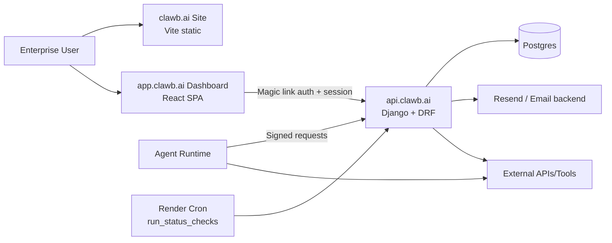
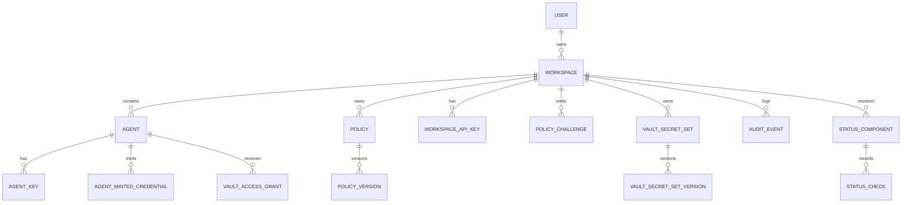
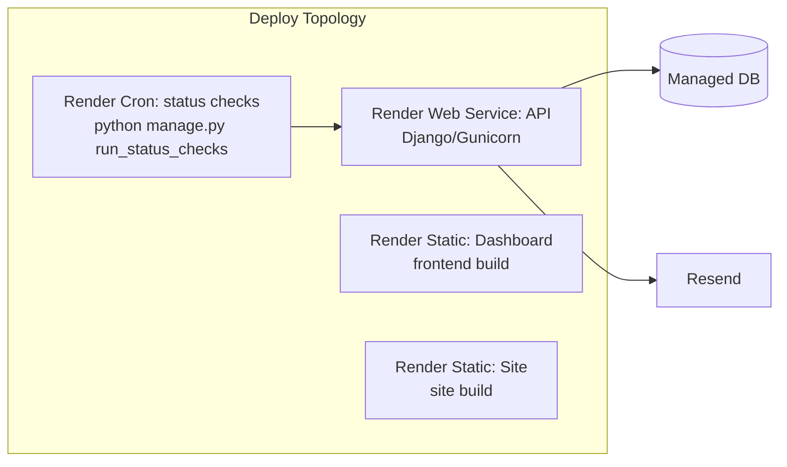

## System context



## Control-plane domains

```mermaid
flowchart TD
  subgraph Auth & Workspace
    L1[POST /auth/start-login] --> L2[Magic link email]
    L2 --> L3[GET/POST /auth/verify-login]
    L3 --> L4[Session cookie + active workspace in session]
    L4 --> L5[GET /auth/me]
    L5 --> L6[GET/POST /v1/workspaces]
    L6 --> L7[POST /v1/workspaces/select]
  end

  subgraph Agent Identity & Policy
    R1[POST /v1/agents/register] --> R2[Agent row + key + challenge]
    R2 --> R3[POST /v1/agents/attest]
    R3 --> R4[Agent active]
    A1[POST /v1/verify] --> P1[Signature + nonce + key checks]
    A2[POST /v1/check] --> P2[Policy eval allow/challenge/deny]
    P2 --> P3[PolicyChallenge + approval links if challenge]
  end

  subgraph Credential & Token
    T1[POST /v1/identity/credentials/mint] --> T2[AgentMintedCredential]
    T3[POST /v1/identity/credentials/revoke] --> T2
    T4[POST /v1/token/exchange] --> T5[Scoped token claims]
    T6[Kill switch endpoints] --> T2
  end

  subgraph Vault
    V1[POST /v1/vault/secret-sets] --> V2[Secret set + versions]
    V3[POST /v1/vault/grants] --> V4[Access grants]
    V5[POST /v1/vault/leases/workflow] --> V6[Workflow lease]
    V7[POST /v1/vault/leases/request/mint] --> V8[Request lease]
    V9[POST /v1/vault/secrets/read<br/>or /v1/vault/proxy/request] --> Ext2[Target API]
  end

  subgraph Status & Contact
    S1[GET /v1/status/summary|checks|errors] --> S2[Status page /status]
    S3[POST /v1/status/checks/run or cron command] --> S4[StatusCheck rows]
    C1[POST /v1/contact/submit] --> C2[ContactSubmission + notify email]
  end
```

## Core data topology



## Deployment topology (Render)


